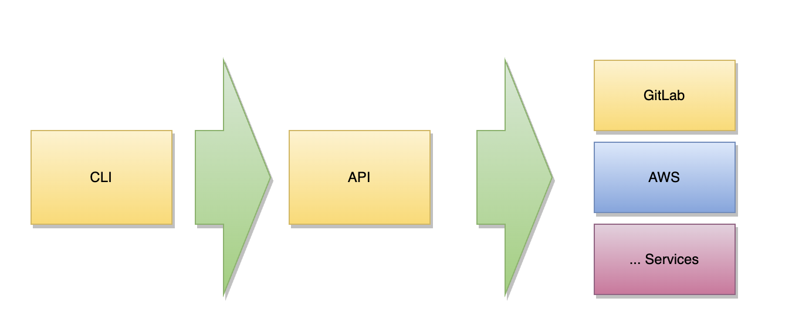

# pets-api

[](https://github.com/tj-actions/coverage-badge-go/actions?query=workflow%3ACI)

[](https://github.com/tj-actions/coverage-badge-go/actions?query=workflow%3A%22Update+release+version.%22)

## Table of contents

* [Layers](#layers)
* [Command](#command)
* [Project setup](#project-setup)
    * [Required](#required)
    * [Optional](#optional)
    * [Script](#script)
* [Tasks](#tasks)
    * [Test](#test)
    * [Build](#build)
* [Configuration](#configuration)
* [RestClient](#restclient)
* [Environment](#environment)

## Layers



## Command

[](https://asciinema.org/a/jI7h9PfaAnZBO31Pj9ysD0Ovk)

## Project setup

Install the following dependencies

### Required

- [Golang Lint](https://golangci-lint.run/)
- [Golang Task](https://taskfile.dev/)
- [Golang Dependencies Update](https://github.com/oligot/go-mod-upgrade)
- [ent - An Entity Framework For Go](https://github.com/ent/ent)

### Optional

If you want to browse api with SSL self-signed certificate

- [NGINX](https://www.nginx.com/)
- [mkcert](https://github.com/FiloSottile/mkcert)

### Script

```shell
brew install go-task/tap/go-task
brew install golangci-lint
go install github.com/oligot/go-mod-upgrade@latest
go install entgo.io/ent/cmd/ent@latest
brew install mkcert
brew install nginx
```

## Tasks

### Test

```shell
task test
```

### Build

```shell
task build
```

## Configuration

Environment configuration is based on Archaius Config, you should use a similar folder structure.
SCOPE env variable in remote environment is required

```
└── config
    ├── config.yml (shared config)
    └── dev
        └── config.yml (for local development)
    └── prod (for remote environment)
        └── config.yml (base config)
        └── {environment}.config.yml (base config)
```

The SDK provides a simple configuration hierarchy

* resources/config/config.properties (shared config)
* resources/config/{environment}/config.properties (override shared config by environment)
* resources/config/{environment}/{scope}.config.properties (override env and shared config by scope)

test.pets-api.internal.com

```
2022/11/20 13:24:26 INFO: Two files have same priority. keeping
    /resources/config/prod/test.config.yml value
2022/11/20 13:24:26 INFO: Configuration files:
    /resources/config/prod/test.config.yml,
    /resources/config/prod/config.yml,
    /resources/config/config.yml
2022/11/20 13:24:26 INFO: invoke dynamic handler:FileSource
2022/11/20 13:24:26 INFO: enable env source
2022/11/20 13:24:26 INFO: invoke dynamic handler:EnvironmentSource
2022/11/20 13:24:26 INFO: archaius init success
2022/11/20 13:24:26 INFO: ENV: prod, SCOPE: test
2022/11/20 13:24:26 INFO: create new watcher
2022/11/20 13:24:26 Listening on port 8080
2022/11/20 13:24:26 Open http://127.0.0.1:8080/ping in the browser
```

## RestClient

```yaml
# gitlab
rest:
  pool:
    default:
      pool:
        size: 20
        timeout: 2000
        connection-timeout: 5000
  client:
    gitlab:
      pool: default
```

```go
var restClients = config.ProvideRestClients()

gitLabClient := gitlab.NewGitLabClient(restClients.Get("gitlab"))
```

## Environment

SECRETS_STORE_GITLAB_TOKEN_KEY_NAME={gitlab_access_token}
SECRETS_STORE_PROD_CONNECTION_STRING_KEY_NAME={mysql_connection_string}